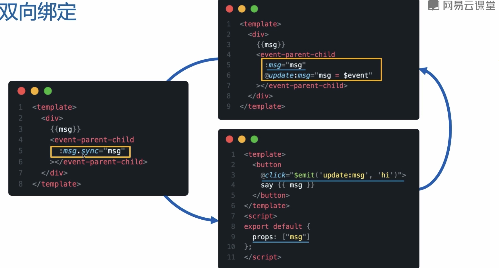
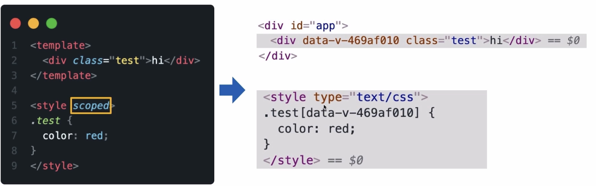

# 事件和样式

## 事件

+ 事件修饰符： .stop
+ 获取事件对象：$event

```js
<template>
  <div>
    <button @click.stop="handleClick($event, 2)">点击</button>
  </div>
</template>

<script>
  export default {
    methods: {
      handleClick(event, num) {
        console.log('点击了')
      }
    }
  }
</script>
```

### 自定义事件

```js
// 父组件
<template>
  <div>
    {{ msg }}
    <child-component :msg="msg" @update:msg="msg = $event" />
  </div>
</template>
// ↓
// ↓ 可以简写成下面这种方式
// ↓ Vue会自动将 :msg.sync 转换为update:msg + :msg
// ↓
<template>
  <div>
    {{ msg }}
    <child-component :msg.sync="msg" />
  </div>
</template>
```

```js
// 子组件
<template>
  <button @click="$emit('update:msg', 'hi')">点击</button>
</template>
<script>
  export default {
    props: ['msg']
  }
</script>
```



## 样式

### class

```html
<template>
  <div
    class="ui-demo"
    :class="{
      'ui-demo--active': isActive,
      'ui-demo--error': hasError,
    }"
  >
  </div>
</template>
```

### style

```html
<template>
  <div
    class="ui-demo"
    :style="{
      'width': `${width}px`,
      'height': `${height}px`,
      'backgroundColor': color,
    }"
  >
  </div>
</template>
```

### scoped

> 通过scoped属性，可以将组件的样式指定为作用域，这样就可以在组件内部使用组件的样式，而不会影响到组件外部的样式

