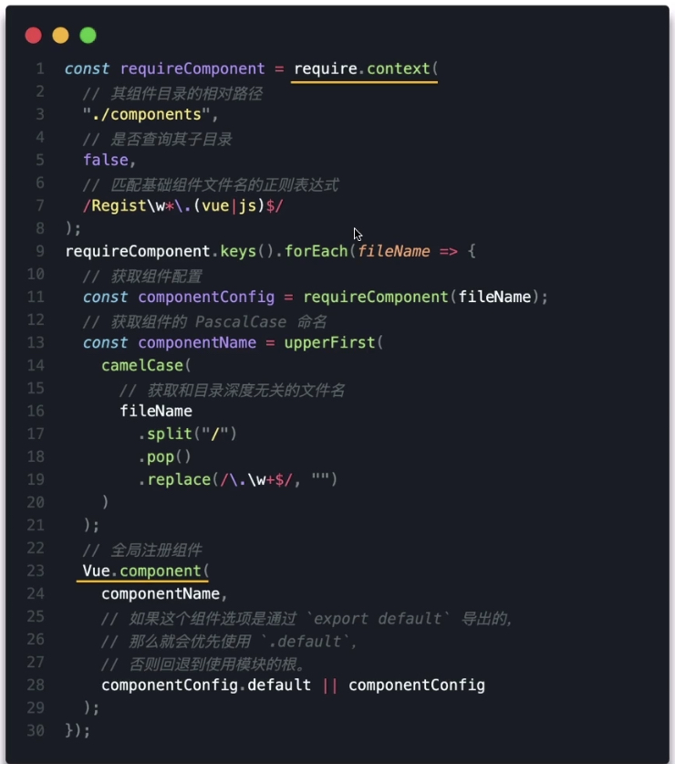
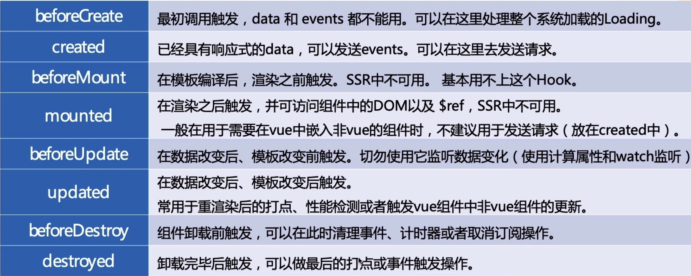

# 组件

## 组件注册

```js
//  全局注册的组件可以在任何地方使用
Vue.component('my-component', {
  template: '<div>Hello</div>'
})

// 局部注册的组件只能在当前组件中使用
<template>
  <div>
    <my-component></my-component>
  </div>
</template>
<script>
  import MyComponent from '.MyComponent'
  export default {
    components: {
      MyComponent
    }
  }
</script>
```

> 如果有一些组件需要经常在页面中使用，又不想每次使用都引用一次,该如何解决？
>> 可以将其注册到全局，然后在页面中使用



### 动态组件

+ `<component v-bind:is="componentName"></component>`

```js
<template>
  <div>
    <component :is="AB"></component>
  </div>
</template>
<script>
  import CA from '.CA'
  import CB from '.CB'
  export default {
    components: {
      CA,
      CB
    },
    data() {
      return {
        ab: true
      }
    },
    computed: {
      AB() {
        return this.ab ? CA : CB
      }
    }
  }
</script>
```

### keep-alivej

+ 缓存组件实例，当需要组件再次显示时，通过vm.$el获得先前DOM元素,然后将其替换到新的组件实例上
+ props:
  + include: 字符串或正则表达式，只有名称匹配的组件会被缓存
  + exclude: 字符串或正则表达式，任何名称匹配的组件都不会被缓存
  + max: 数字。最多可以缓存多少组件实例
+ 被缓存的组件会多出两个生命周期
  + activated: keep-alive 内组件加载成功后调用
  + deactivated: keep-alive 内组件缓存成功后调用

```js
<keep-alive>
  <component :is="AB"></component>
</keep-alive>
```

## 生命周期


