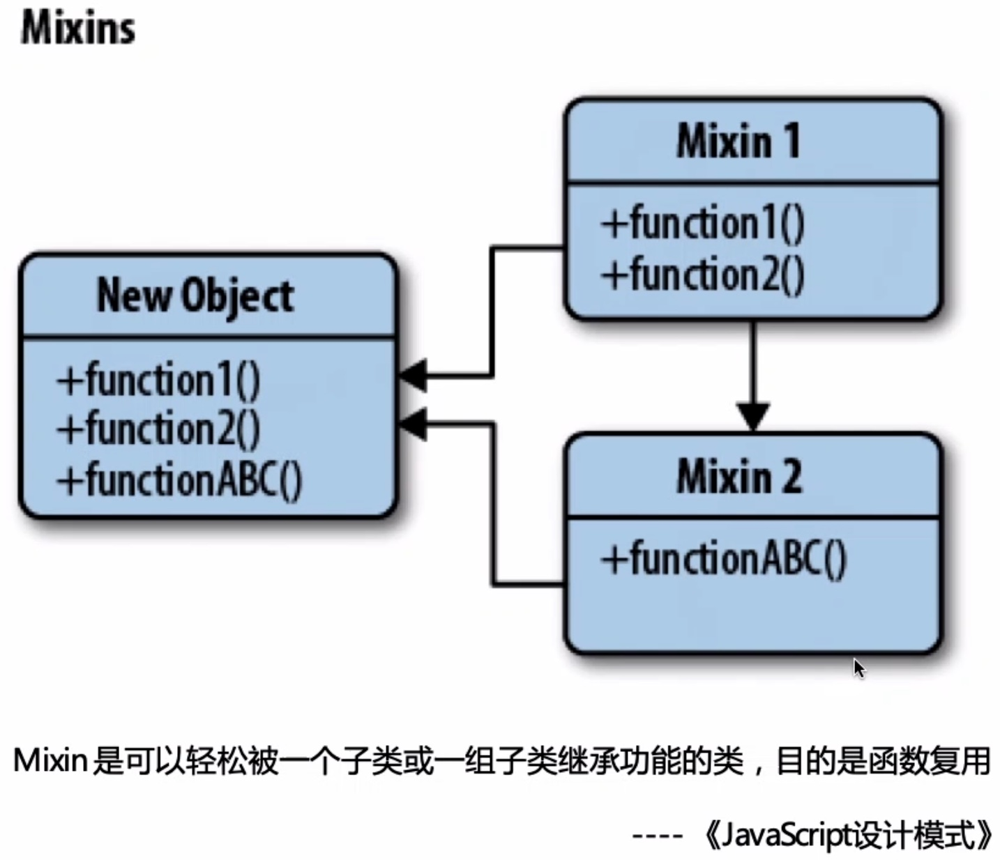
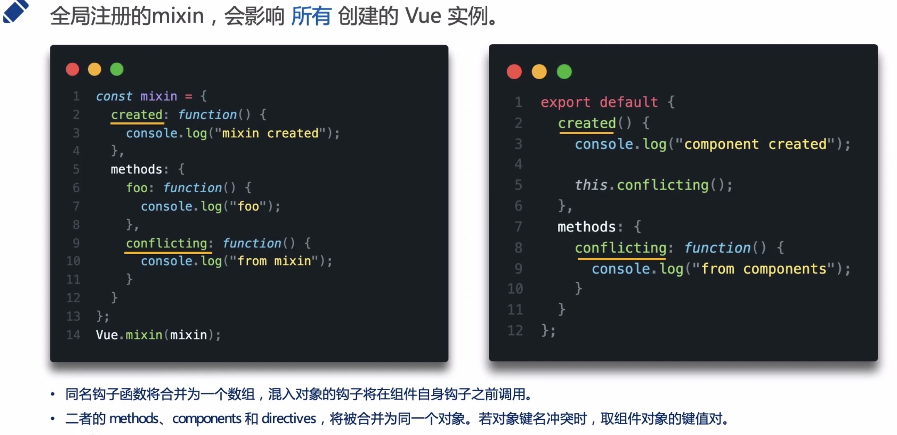
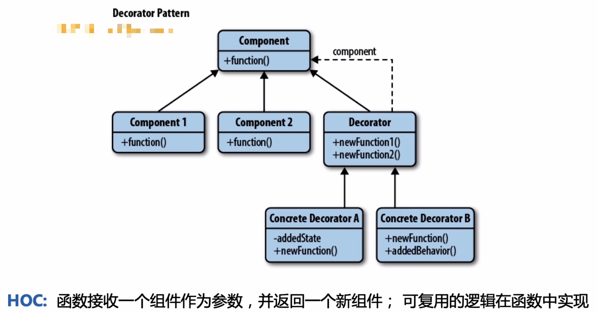
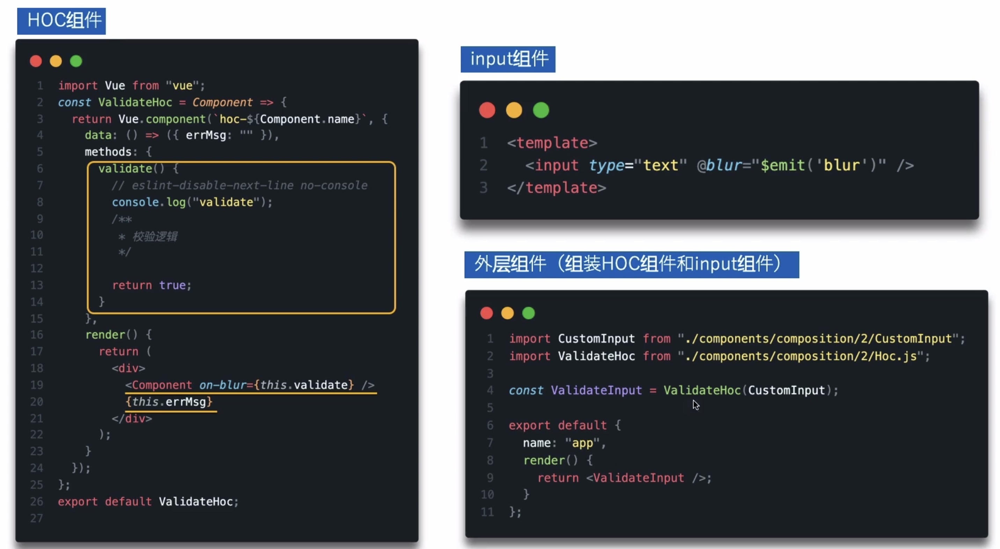
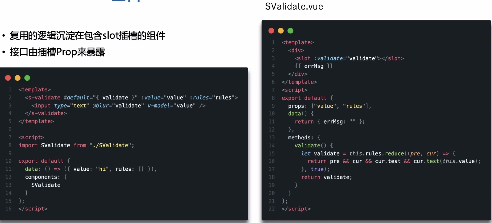

# 组件复用

## Mixins

+ 缺陷：
  + 打破了原有组件的封装
  + 增加了组件复杂度
  + 可能会出现命名冲突的问题
  + 仅仅是对逻辑的复用，模板不能复用

## 函数式组件及HOC

+ 相比较Mixins的优点
  + 模板可复用
  + 不会出现命名冲突
+ 不足
  + 组件复杂度高，多层嵌套，调试会很痛苦

## Renderless组件

+ 优点
  + 模板可复用
  + 不会出现命名冲突
  + 符合依赖倒置原则
  + 复用的接口来源清晰
