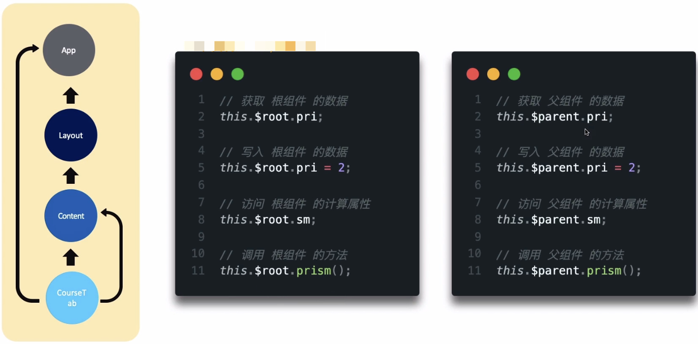
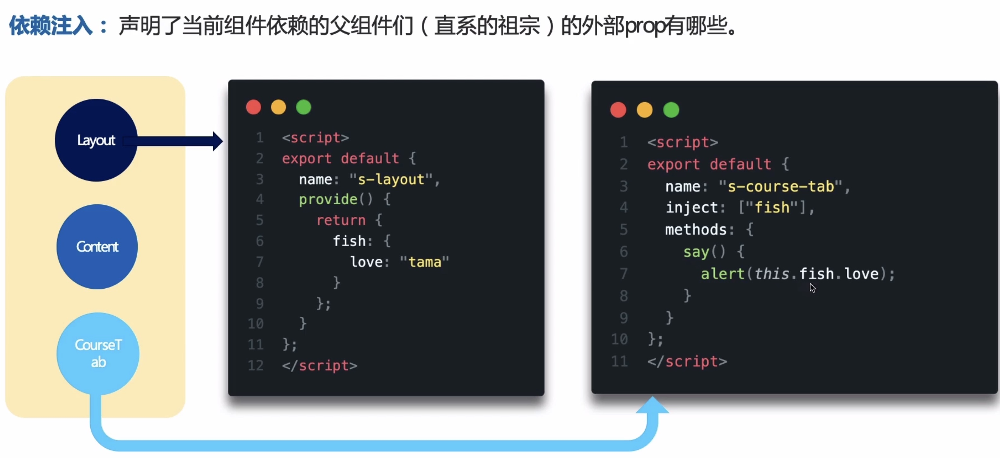
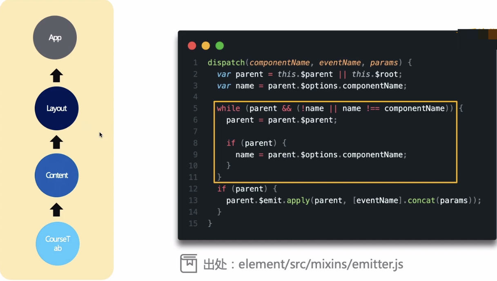

# 组件间通信

## 访问外层组件

+ `this.$root`访问当前组件的根组件
+ `this.$parent`访问当前组件的父组件



> 依赖注入



> 发送定向消息



## ref

```html
<base-input ref="usernameInput" />
```

```js
// $ref只能在mounted钩子被调用之后才能使用
this.$refs.usernameInput.focus()
```

## 属性透传

+ `this.$attrs`来传递父组件上的 prop class 和 style
+ `this.$listeners`来传递父组件上的事件监听器和事件修饰符

```html
<!-- 子组件 child-input  -->
<div>
  <el-input v-bind="$attrs" v-on="$listeners" />
</div>

<!-- 父组件 -->
<div>
  <child-input v-model="value" @blur="onBlur" />
</div>
```

## $emit

> 子组件触发父组件传递的事件

```js
this.$emit('myEvent')
```

```html
<my-component v-on:myEvent="doSomething"></my-component>
```
