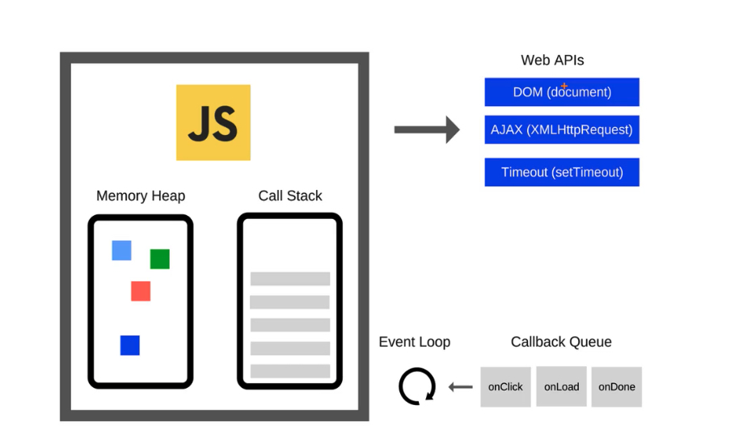
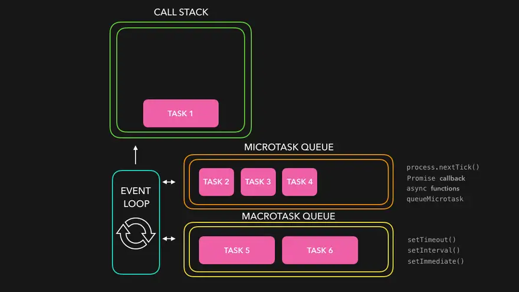

# Event Loop


+ `Call Stack`: 调用栈，先进后出。方法执行时入栈，执行完毕出栈。
+ `Memory Heap`: 堆内存，用于存放对象。
+ `Web API`: 产生异步任务的接口。
  + Dom api
  + Ajax
  + Timeout
+ `Queue`:
  + `macrotask queue`: 宏任务队列
    + setTimeout
    + setInterval
    + setImmediate
  + `microtask queue`: 微任务队列
    + process.`nextTick()`
    + async `function() {}`
    + Promise().then(`function() {}`)
    + queueMicrotask
+ `Event Loop`: 事件轮询，用于连接call stack和 queue。

## even loop执行原理
1. 同步任务先执行，按顺序在 `call stack`中出栈入栈
2. 当`call stack`为空时，`event loop`开始异步任务的轮询
3. `event loop`按先入先出顺序从`宏任务`中依次调取任务执行
   + 每次执行`宏任务`之前，都会先执行完`微任务`队列中的所有任务
```js
const foo = () => console.log("First");
const bar = () => setTimeout(() => console.log("Second"), 500);
const baz = () => console.log("Third");

bar();
foo();
baz();
```

