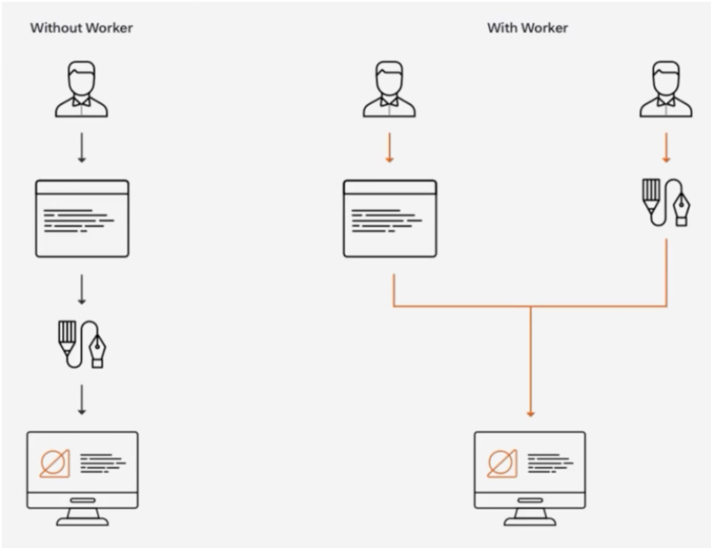
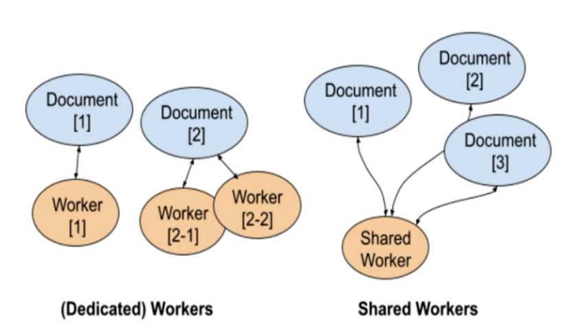
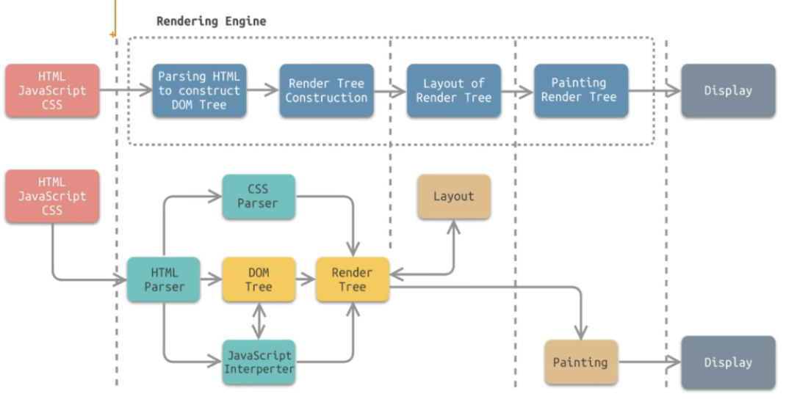
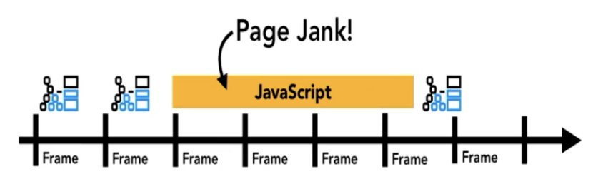
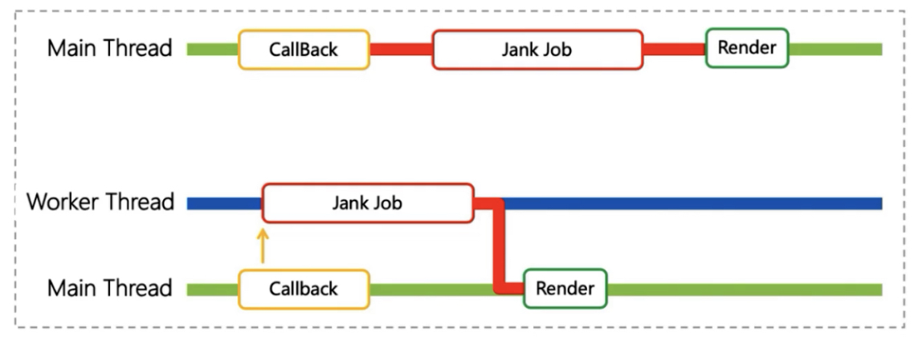
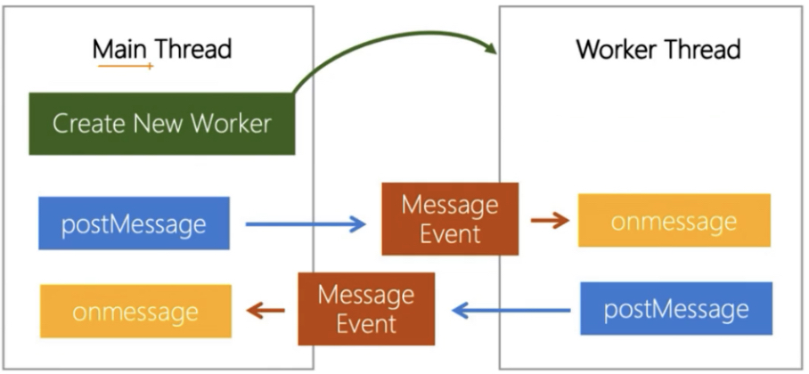
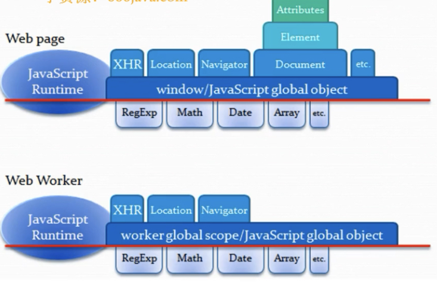

# web Worker多线程机制

## worker概念
将耗时的js操作交由worker线程执行，执行完毕后通知main线程。


## worker分类
+ √ DedicatedWorker(独立worker, 主流)
+ × SharedWorker(共享worker)
```js
// 创建 DedicatedWorker
const worker = new Worker('worker.js');

// 创建 SharedWorker
const worker = new SharedWorker('worker.js');
```


## 主线程和多线程
### 浏览器渲染流程

### js会阻塞用户交互和页面渲染

### web worker解决js阻塞渲染问题
将耗时的js操作放到单独的worker线程中执行，执行完毕后通知main线程


## web Worker API
```js
// main.js
const worker = new Worker('worker.js');
worker.onmessage = function(e) {
  console.log(e.data);
}
worker.postMessage('hello worker');

// worker.js
self.onmessage = function(e) {
  console.log(e.data);
  postMessage('hello main');
}
```


## 运行环境差异

+ Worker线程没有DOM API, 无法新建和操作DOM, 也无法访问到主线程的DOM Element.
+ Worker线程和主线程间内存独立，Worker线程无法访问页面上的全局变量(window, document)和JavaScript函数
+ Worker线程不能调用 alert(), confirm(), prompt() 等UI相关的BOM API
+ Worker线程受主线程控制，主线程可以新建和销毁Worker线程
+ Worker线程可以通过`self.close()`自行销毁

## web Worker应用场景
+ 减少卡顿
> 根据chrome团队提出的用户感知性能模型RAIL, 同步JS执行时间不能过长，量化来说，播放动画时建议小于16ms(60hz, 1000ms 60帧，16ms 1帧),用户操作响应建议小于100ms,页面打开到开始呈现内容建议小于1000ms。

