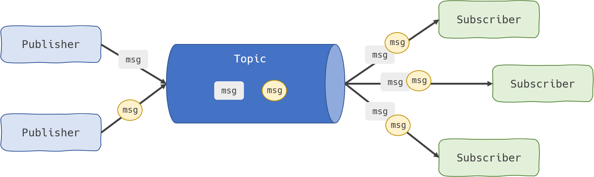
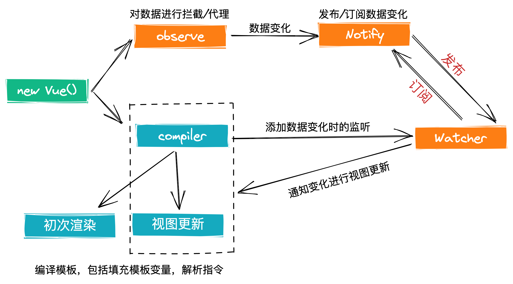

# 响应式框架基本原理
数据发生变化时，不需要开发者手动更新视图，视图会根据变化的数据自动更新。想完成这个过程，需要做到一下几点：
+ `依赖搜集`--知道视图依赖了哪些数据
+ `数据劫持/数据代理`--能够感知到数据发生了变化
+ `发布/订阅模式`--数据发生变化时，自动通知需要更新的视图部分，并进行更新

## 数据劫持/数据代理
`Object.defineProperty` vs `Proxy`
+ `Object.defineProperty` 不能监听数组的变化，需要对数组方法进行重写
+ `Object.defineProperty` 必须遍历对象的每一个属性，如[1, 2, 3, 4]，需要分别对 key 为 0, 1, 2, 3 的属性进行监听
+ `Proxy` 可以监听数组的变化
+ `Proxy` 的代理是针对整个对象的，而不是针对对象的某个属性，如[1, 2, 3, 4] Proxy只需做一层代理就可以监听同级结构下的所有属性变化
+ `Proxy` 除了可以代理`set`和`get`之外，还可以使用其它13种拦截方法

## 模板编译
使用`正则`+`遍历`的方式，对`#app`节点下的内容进行替换

## 发布订阅
在软件架构中，`发布-订阅`是一种消息范式，消息的发送者(称为`发布者`)不会将消息直接发送给特定的接受者(称为`订阅者`)。而是将发布的消息分为不同的类别(`topic`)，无需了解哪些订阅者可能存在，同样的，订阅者可以表达对一个或多个topic的兴趣，只订阅感兴趣的topic，无需了解哪些发布者存在。

# 完整的MVVM流程

# 虚拟dom
## 什么是虚拟dom
虚拟dom就是用数据结构表示DOM结构，它并没有真实挂载到DOM上，因此被称为虚拟dom。

## 虚拟dom的好处
操作数据结构远比通过和浏览器交互去操作dom来的快