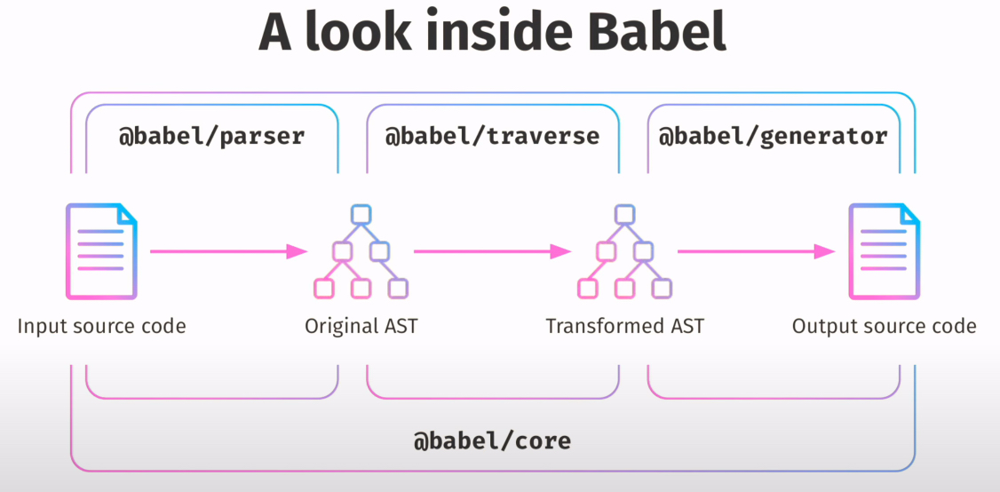

# 什么是Babel
Babel 是 JavaScript 编译器，更确切地说是源码到源码的编译器，通常也叫做“转换编译器（transpiler）”。 意思是说你为 Babel 提供一些 JavaScript 代码，Babel 更改这些代码，然后返回给你新生成的代码。

此外它还拥有众多模块可用于不同形式的静态分析
> 静态分析是在不需要执行代码的前提下对代码进行分析的处理过程 （执行代码的同时进行代码分析即是动态分析）。 静态分析的目的是多种多样的， 它可用于语法检查，编译，代码高亮，代码转换，优化，压缩等等场景。

# Babel的处理步骤


Babel 的三个主要处理步骤分别是： **解析（parse）**，**转换（transform）**，**生成（generate）**。

## 解析
解析步骤接收代码并输出`AST`，这个阶段可以分为两个阶段:
+ 词法分析
+ 语法分析

### 词法分析
词法分析阶段把字符串形式的代码转换为 **令牌(tokens)**流
```js
n * n
```
```js
[
  { type: { ... }, value: "n", start: 0, end: 1, loc: { ... } },
  { type: { ... }, value: "*", start: 2, end: 3, loc: { ... } },
  { type: { ... }, value: "n", start: 4, end: 5, loc: { ... } },
  ...
]
```
每一个`type`有一组属性来描述该令牌:
```js
{
  type: {
    label: 'name',
    keyword: undefined,
    beforeExpr: false,
    startsExpr: true,
    rightAssociative: false,
    isLoop: false,
    isAssign: false,
    prefix: false,
    postfix: false,
    binop: null,
    updateContext: null
  },[](https://astexplorer.net/)
  ...
}
```
### 词法分析
语法分析阶段会把一个令牌流转换成 AST 的形式。 这个阶段会使用令牌中的信息把它们转换成一个 AST 的表述结构，这样更易于后续的操作。

## 转换
转换步骤接收 AST 并对其进行遍历，在此过程中对节点进行添加、更新及移除等操作。 这是 Babel 或是其他编译器中最复杂的过程 同时也是插件将要介入工作的部分。

## 生成
代码生成步骤把最终（经过一系列转换之后）的 AST 转换成字符串形式的代码，同时还会创建源码映射（source maps）。.
代码生成其实很简单：深度优先遍历整个 AST，然后构建可以表示转换后代码的字符串。

# Babel插件
```js
// 1 create a function
//   babel: 获取babel的API
//   options: myPlugin的自定义配置
function myPlugin(babel, options) {
    return {
        // 2 choose a plugin name
        //   需要遵守 babel-plugin-<plugin-name> 的命名规则
        name: 'my-plugin',
        // 3 define traverse visitor
        //   遍历访问AST node
        visitor: {
            CallExpression(path, state) {
                /** do something */
            }
        },
        // 4 modify Babel's options
        //   修改Babel的配置
        manipulateOptions(babelOptions) {},
        // 5 extend another plugin
        //   通过继承其他插件，从而拓展更多的功能
        inherits: require('another plugin')
    }
}
export default myPlugin
```

AST
> Abstract Syntax Tree 抽象语法树。
> 
> 
> [AST Explorer](https://astexplorer.net) 这个网站可以让你对 AST 节点有一个更好的感性认识


# 参考链接


