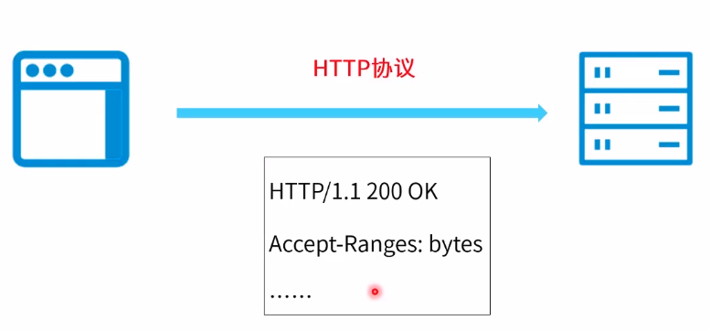
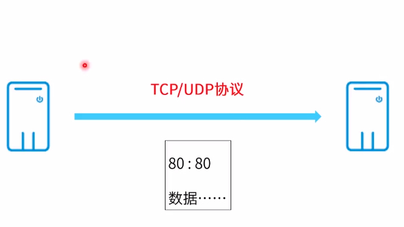
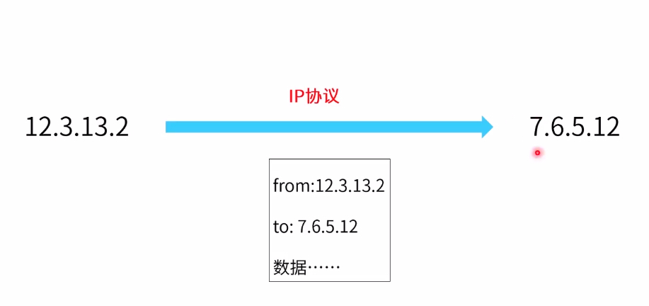
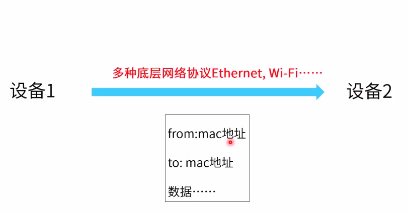
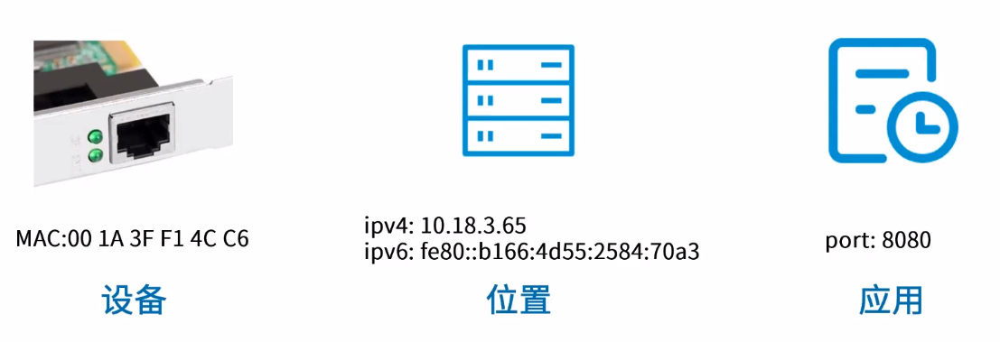
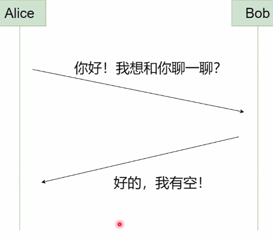
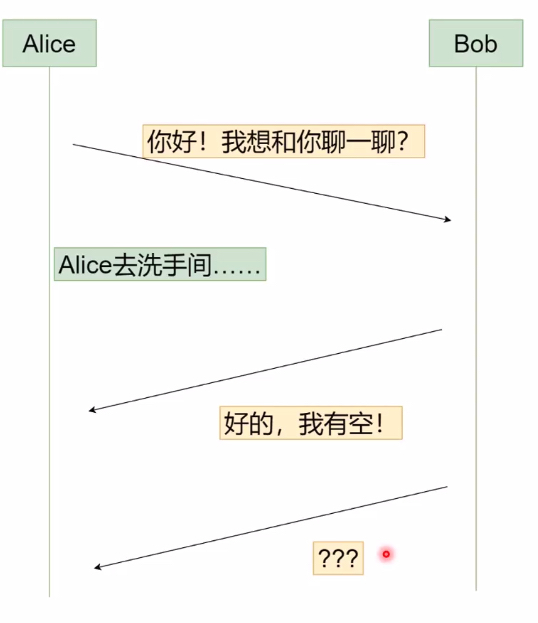
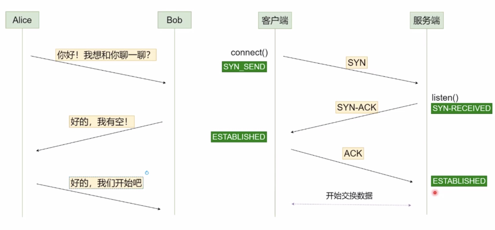
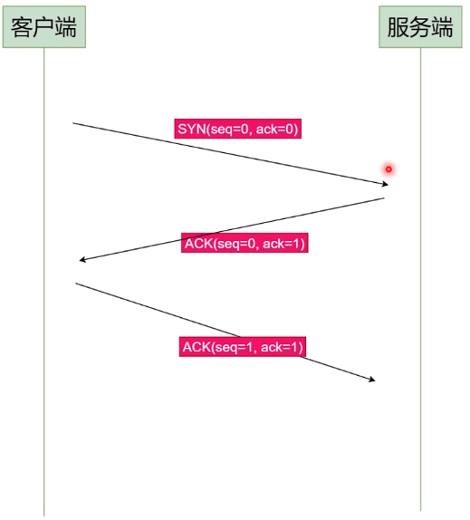

# TCP/IP协议群
1. 应用层: ftp、http 等提供应用间的通信能力

   
2. 传输层: tcp、udp 等 提供主机到主机的通信能力

   
3. 网络层: ipv4、ipv6 等 提供地址到地址的通信能力

   
4. 链接层: 提供设备到设备的通信能力

   

5. 物理层:

## 重要标识
1. port: 端口表示应用层的某个端口，每个应用层的端口都是唯一的
2. ip: 是一个服务器地址，每个地址都是唯一的
3. mac: 是一个网络设备的地址，每个地址都是唯一的

## TCP为什么要三次握手
想象一下一个场景 Alice 和 Bob 微信聊天

如果像上面情况，是可以继续聊天的，但是有可能发生下面这种异常情况

Alice 在问完 ”你好！我想和你聊一聊？“之后去了趟厕所，然后期间Bob回复了Alice,但是没有得到响应，此时Bob会认为Alice可能暂时在忙，Bob会等一等然后再次询问。然如果把Alice和 Bob想成机器人，那么机器人Bob在回复完 ”好的，我有空！“后没有得到Alice的回复，那么机器人Bob会认为自己这条信息没有发送成功，有可能会一直重复发送这条信息。

所以至少需要三次握手，才能完成一次完整的tcp传输

### 如何保证消息顺序
消息的绝对顺序用(SEQ, ACK)这一对元组描述
+ SEQ(Sequence)：这个消息发送前一共发送了多少字节
+ ACK(Acknowledge)：这个消息发送前一共收到了多少字节

