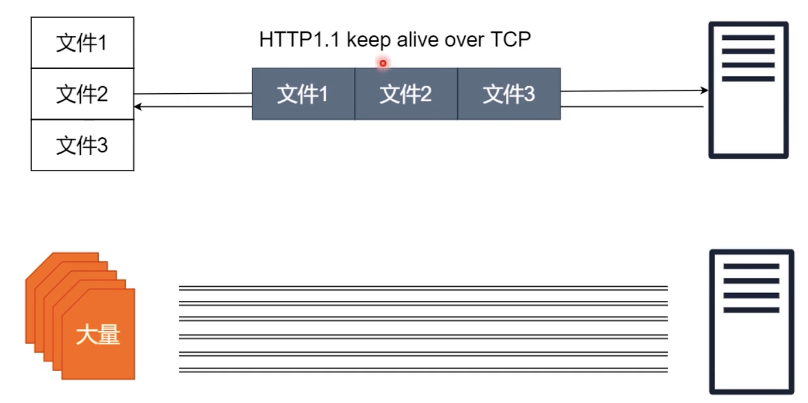
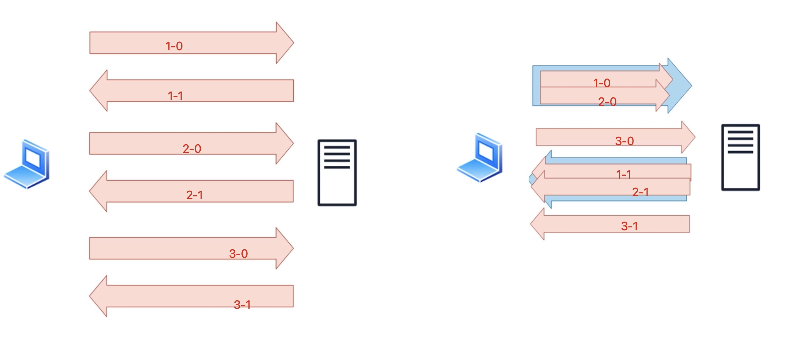
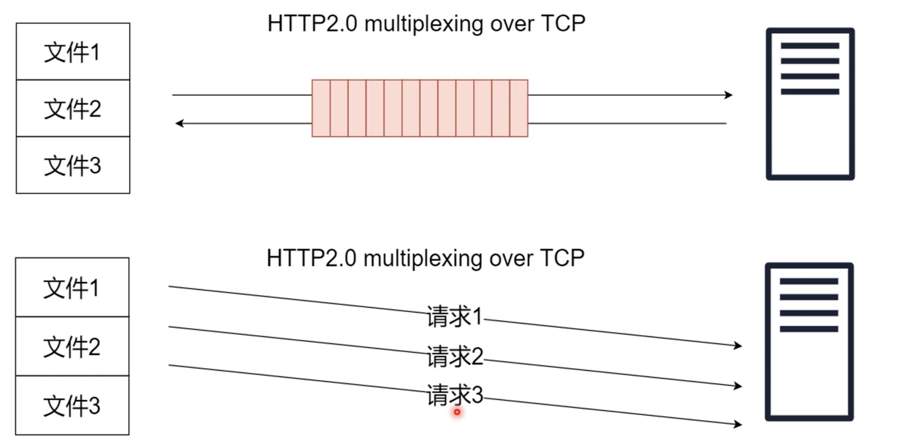
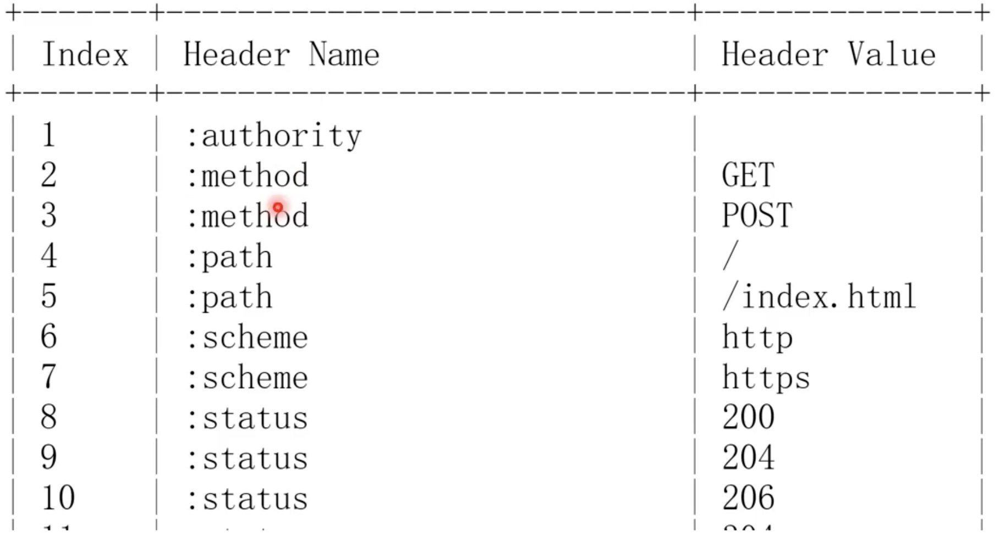
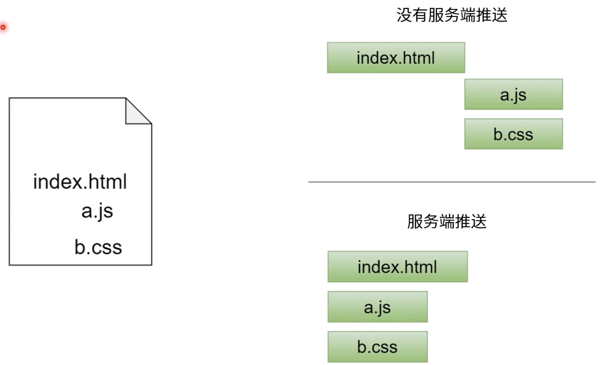

# HTTP2.0目标
+ 多个请求多路复用
+ 防止队头阻塞
+ 压缩HTTP头部
+ 服务端推送

## 多路复用
### HTTP1.1排队问题
1. 三个文件下载共用一个tcp，任意一个阻塞都会阻塞后续文件下载
2. 如果一个网页有大量请求, 浏览器最多会建立6个tcp连接

### HTTP2.0多路复用
1. 左侧http1.1版本，多个请求依次排队，第一个请求响应结束才能发送第二次请求，以此类推
2. 右侧http2.0版本，每个请求被分割成多个数据包，多个请求的数据包可以并行发送，不会互相阻塞

## 防止队头阻塞
HTTP2.0中每个请求都会被分割成多个数据包，多个请求的数据包混在一起并行发送，不会互相阻塞

## 压缩头部
+ HPACK技术
  - 压缩(2 代表 METHOD GET)

  

## 服务端推送
+ index.html中依赖 a.js和 b.css, http1.1中浏览器解析index.html时发现依赖了a.js和b.css, 就会下载a.js和b.css，而http2.0中服务端在发送index.html时就会推送a.js和b.css

