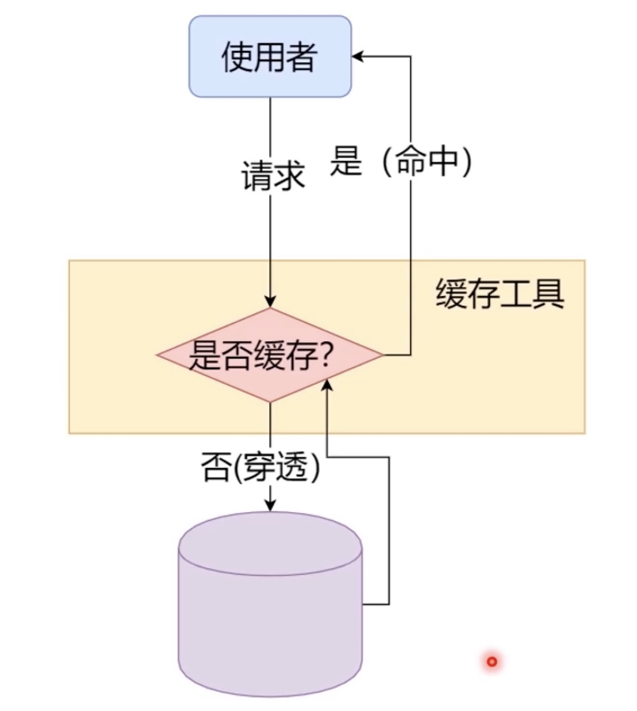
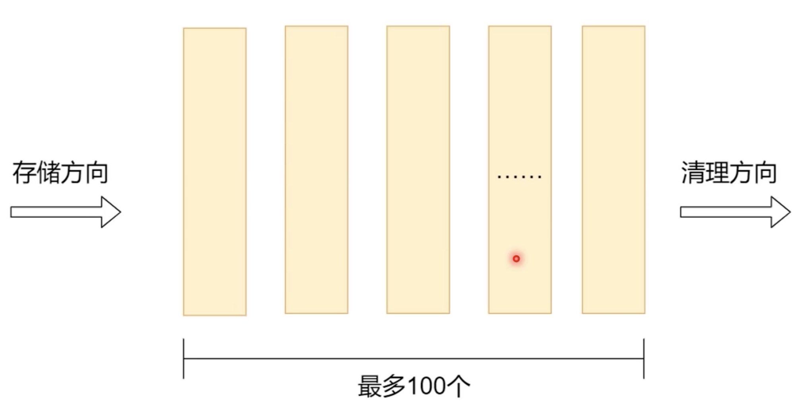
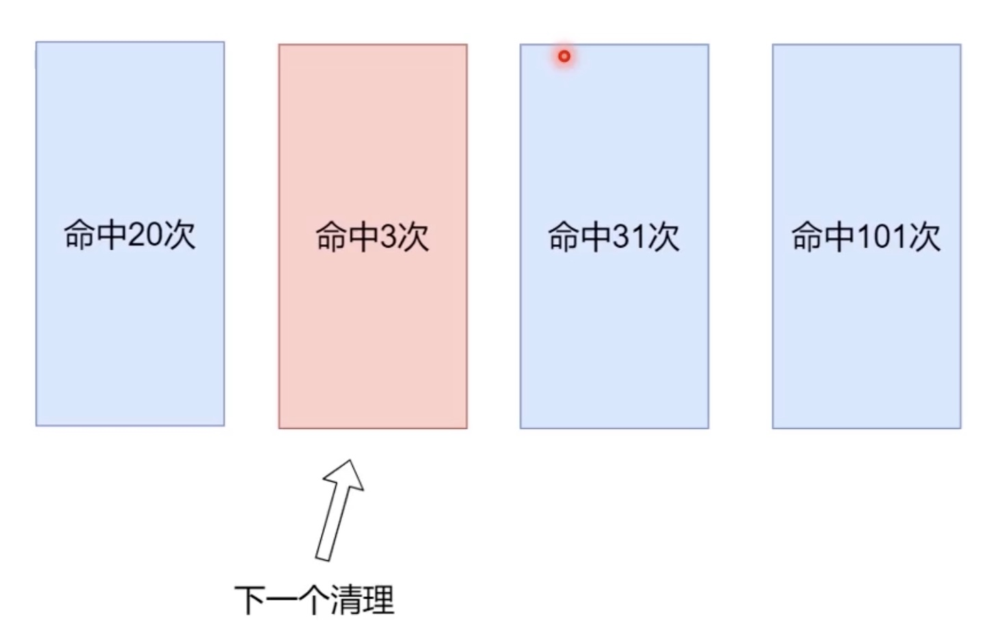
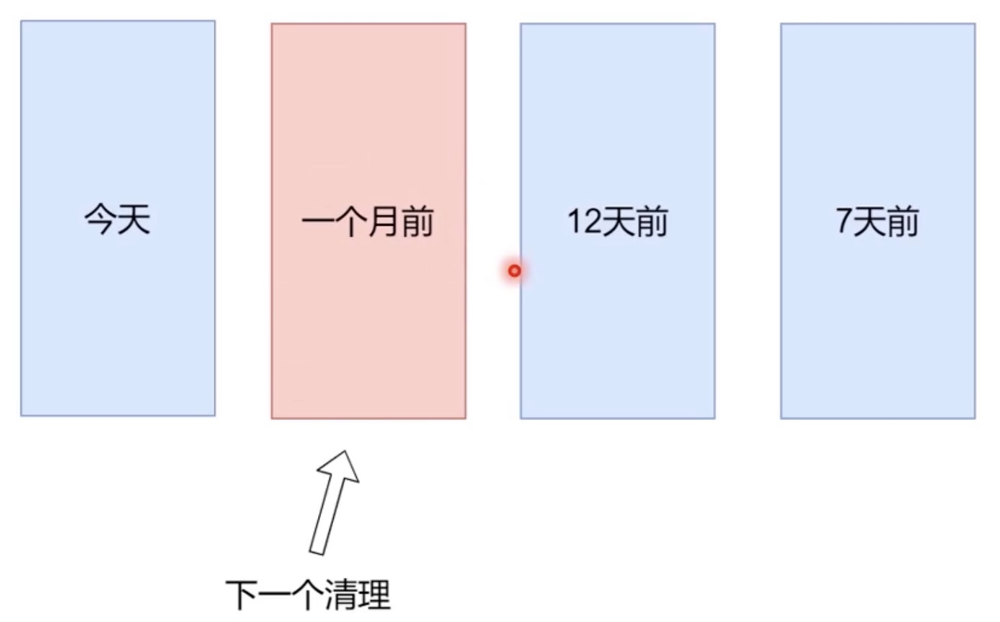

## 什么是缓存？

+ 命中： 在缓存中找到了请求的数据
+ 不命中/穿透：缓存中没有找到请求的数据
+ 命中率：命中次数/总次数
+ 缓存大小：缓存中一共可以存多少数据
+ 清空策略：如果缓存空间不够，数据如何被替换

## 清空策略

### FIFO

### 按命中率清空

### 按更新时间清空

## Http缓存

> 缓存控制

|值|含义|
|-|-|
|public|响应可以被任何中间人（比如中间代理、CDN 等）缓存|
|private|只允许浏览器缓存,不允许中间方缓存|
|no-cache|**缓存但重新验证**, 每次必须先询问服务器资源是否已经更新|
|no-store|缓存中不得存储任何关于客户端请求和服务端响应的内容。每次由客户端发起的请求都会下载完整的响应内容|

> 过期

|值|含义|
|-|-|
|max-age|秒(存储周期)|
|s-maxage|秒(共享缓存如代理等，存储周期)|

> 强制缓存
>>强制使用缓存，不去服务器对比；（缓存生效不再发送请求）

+ Cache-Control: max-age = 600
  + 推荐使用
+ Expires: <最后期限>

> 协商缓存
  >> 协商使用缓存，每次请求都需要向服务器请求对比，缓存生效不传回body

+ 协商缓存1
  + 返回： Last-Modified: <最后更新时间>
  + 请求： If-Modified-Since: <最后更新时间>

+ 协商缓存1
  + 返回： ETag: <标签>
  + 请求： If-None-Match: <标签>
