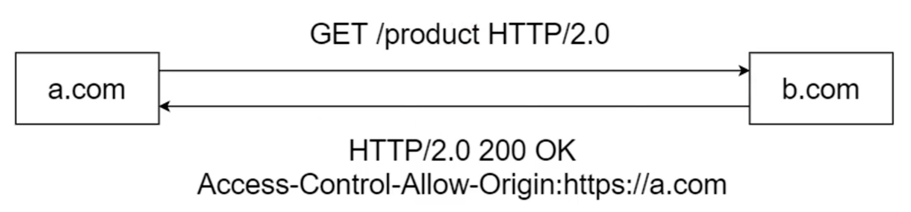
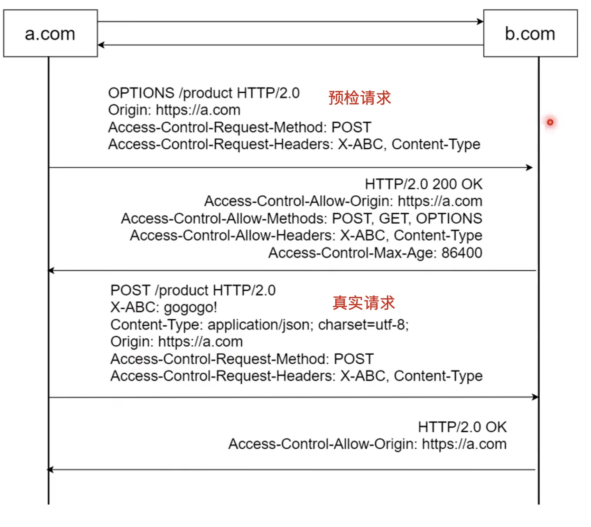
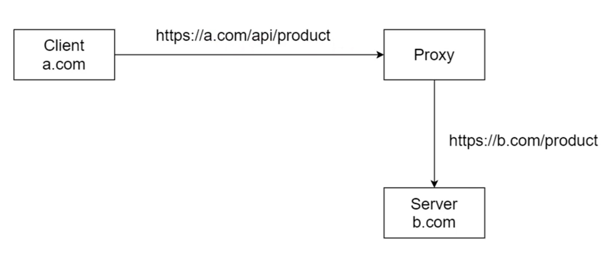

# 同源策略

## 定义

+ 禁止一个源(origin)访问另一个源(origin)的资源
  + 两个URL的protocol,host和post相同，那么同源

## 跨域的N种方法

### Jsonp

> 利用浏览器不限制跨域脚本执行的特点

```js
// data.js
jsonp('/example,' {
  a: 1,
  b: 2
})

// index.html
function jsonp(topic, data) {
  console.log(topic, data);
}
const script = document.createElement('script');
script.setAttribute('src', 'data.js');
document.getElementByTagName('head')[0].appendChild(script);
```

### 跨域资源共享cors

> 跨域资源共享(Cross Origin Resource Sharing), 使用额外的HTTP头允许指定的源和另一个源进行交互

+ 简单cors



+ 复杂cors



## 代理

> 利用代理将不同源的资源代理到同源的资源, 因为同源策略是浏览器的限制，代理并不受限制


