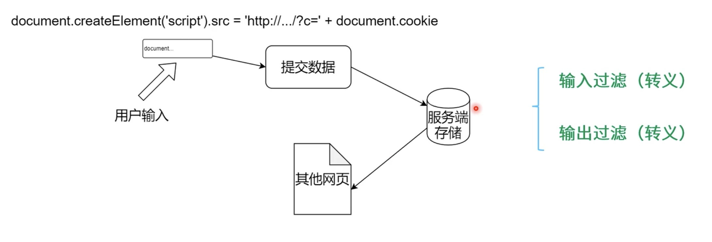
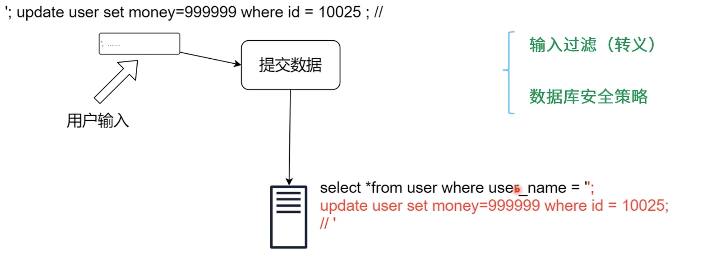
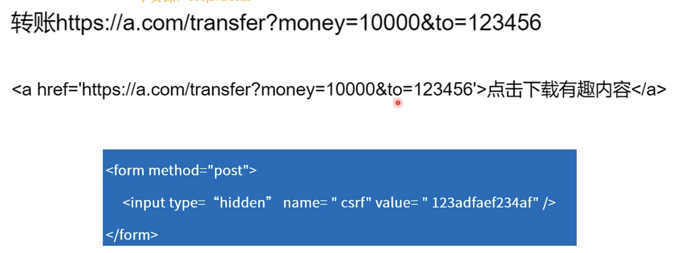
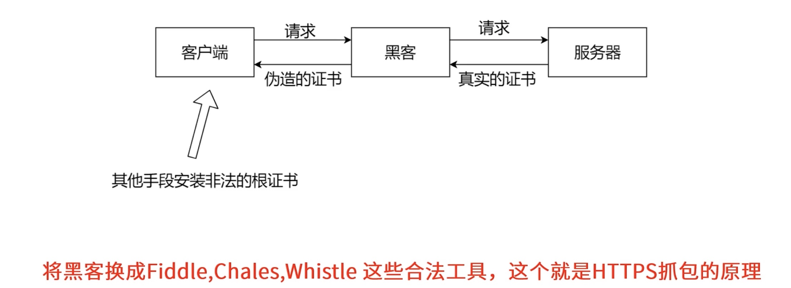

# 网络完全攻防

## 阻断服务攻击(DoS)

> 阻断服务攻击(Denial-of service attack), 想办法将目标网络资源用尽
> 变种：分布式租单服务攻击(Denial-of service attack), 侵入大量普通用户电脑当做肉鸡，以便攻击目标网络资源

+ 宽带消耗型：消耗目标的带宽
+ 资源消耗型：消耗目标的计算资源

## 跨站脚本攻击(XSS)

> 将跨站脚本注入到被攻击的网页上，用户打开网页会执行跨站脚本

## SQL注入攻击(SQL Injection)

## 跨站请求伪造攻击(CSRF)

## HTTPS中间人攻击(MFA)

