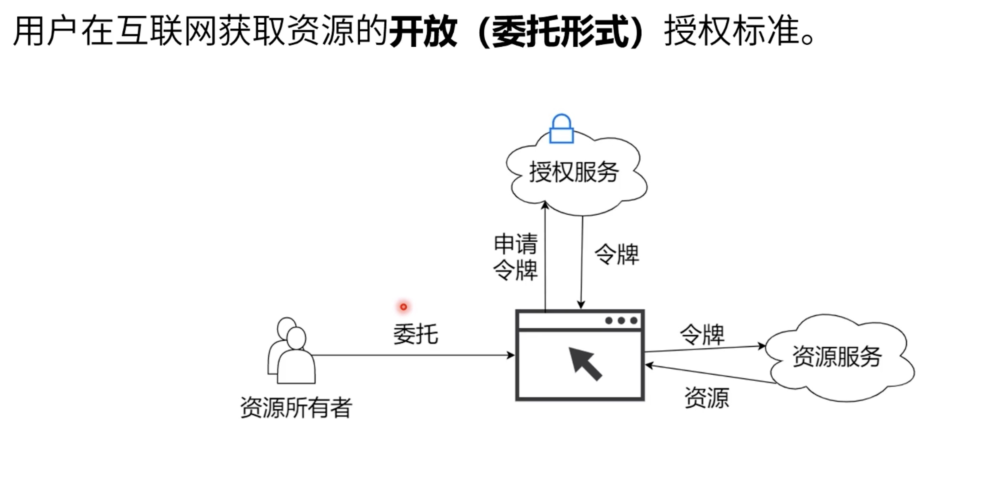
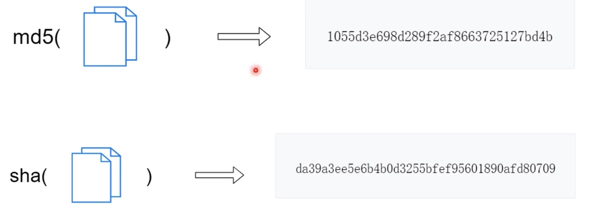
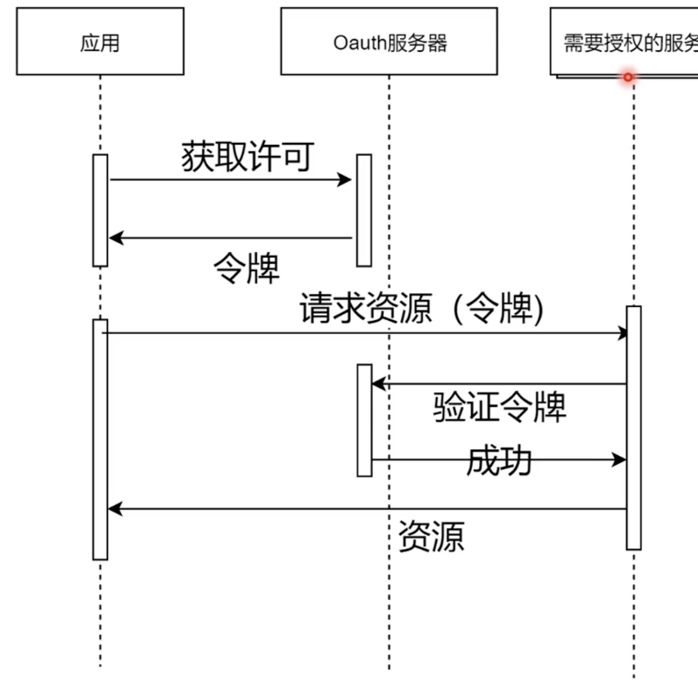

## 浏览器端存储
||cookie|Local Storage|Session Storage|
|-|-|-|-|
|容量|4kb|10mb|5mb|
|作用域|同源|同源|当前网页|
|过期时间|手动设置|永久|当前网页关闭|
|位置|浏览器/服务端|浏览器|浏览器|

## Oauth

+ 申请令牌： 短信验证、邮箱验证、微信验证、Google验证...
+ 生成令牌：摘要算法，将数据运算成一段不可逆的唯一摘要
  + 
+ 如何保证Token唯一?
  + 散列算法： sha(client_id + 随机数 + 时间戳)

## 单点登录SSO

