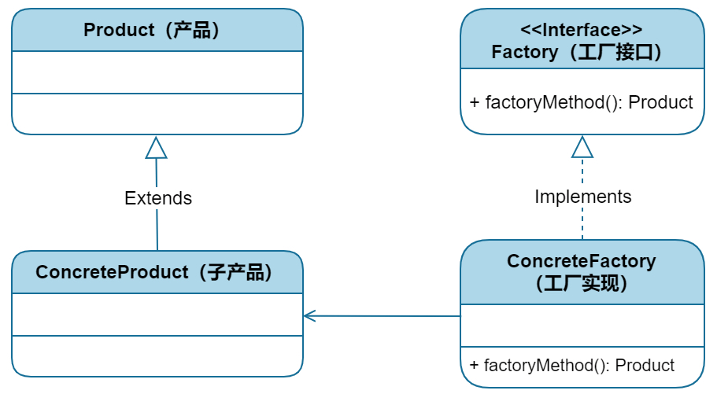
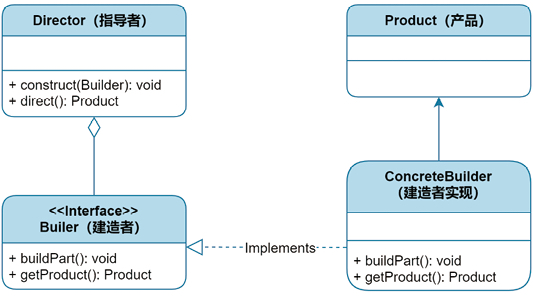

# 设计原则
+ 开闭原则
+ 单一职责原则：一个模块只做一件事情，模块的功能越单一越好
+ 依赖倒置原则：上层模块不要依赖具体的下层模块，而应该依赖抽象层模块
+ 接口隔离原则：细化接口，让每个接口的职责尽量单一
+ 迪米特法则
+ 里氏替换原则：关注于继承，任何父类出现的地方，子类都可以出现

# 分类
+ 创建型：帮助我们优雅的创建对象
  + 工厂模式-大量创建对象
    + 
  + 单例模式-全局只能有我一个
    + 
  + 建造者模式-精细化组合对象
  + 原型模式-JavaScript的灵魂
+ 结构型：帮助我们优雅的设计代码结构
  + 外观模式-给你的一个套餐
  + 享元模式-共享来减少数量
  + 适配器模式-用适配代替更改
  + 桥接模式-独立出来，然后再对接过去
  + 装饰者模式-更优雅的扩展需求
+ 行为型：模块之间行为的模式总结，帮助我们组织模块行为
  + 观察者模式-我作为第三方转发
  + 职责链模式-像生产线一样组织模块
  + 状态模式-用状态代替判断
  + 命令模式-用命令去解耦
  + 策略模式-算法工厂
  + 迭代器模式-告白for循环
+ 技巧型：一些帮助我们优化代码的技巧
  + 链模式-链式调用
  + 惰性模式
  + 委托模式-让别人代替你收快递
  + 等待者模式-等你们都回来再吃饭
  + 数据访问模式-一个方便的数据管理器